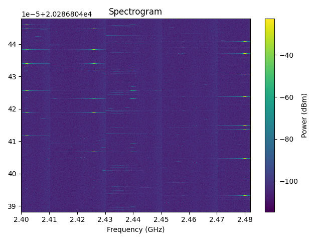
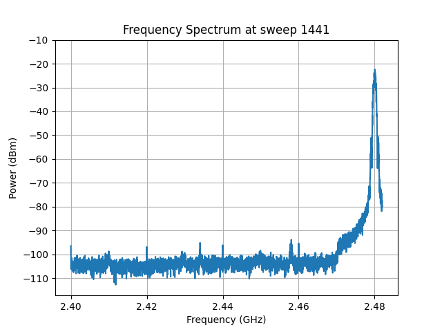

========
Examples
========

Basic Usage
===========
This is an example on how to open an SHR file and read its header.

.. code-block:: python

    from shr_parser import ShrFileParser
    x = ShrFileParser('foo.shr')
    x.open()
    header = x.header
    x.close()
    print(header)

The above example opens the SHR file, gets the header, closes the file, and finally prints the header. It uses the
open and close methods, however, it is recommended that context management is used instead. The above code can be
rewritten as such:

.. code-block:: python

    from shr_parser import ShrFileParser
    with ShrFileParser('foo.shr') as f:
        print(f.header)

Reading Sweeps
==============
An SHR file also contains spectrum sweeps. There are a few means of getting spectrum sweeps. The first method is by reading
one sweep from the file at a time:

.. code-block:: python

    from shr_parser import ShrFileParser
    with ShrFileParser('foo.shr') as f:
        for i in range(len(f)):
            sweep = f.get_sweep_n(i)
            print(sweep)

The above code accesses all the sweeps via their index from the SHR file in chronological order, but it should be noted
that sweeps can be accessed in any order desired. There is another way of accessing sweeps like the method above:

.. code-block:: python

    from shr_parser import ShrFileParser
    with ShrFileParser('foo.shr') as f:
        for sweep in f:
            print(sweep)

Unlike the previous method, this method delegates the indexing to inside the class instead. However, both methods only
load one sweep at a time from the file. If all the sweeps want to be loaded, then the above code can be written as such:

.. code-block:: python

    from shr_parser import ShrFileParser
    with ShrFileParser('foo.shr') as f:
        sweeps = f.get_all_sweeps()
    for sweep in sweeps:
        print(sweep)

By getting all the sweeps, the file can be closed before processing the data.

Plotting a spectrogram
======================

Sometimes we want to visualize the data that was recorded from the Signal Hound. A common way to visualize RF data is
through a spectrogram, where the x-axis is the frequency, the y-axis is the time, and the color represents the received
power. Luckily, the library implements a simple way to visualize the data in this manner:

.. code-block:: python

    from shr_parser import ShrFileParser
    from shr_parser.visualization import spectrogram
    import matplotlib.pyplot as plt
    with ShrFileParser('foo.shr') as f:
        sweeps = f.get_all_sweeps()
    if len(sweeps) > 512:
        spectrogram(sweeps[:512])
    else:
        spectrogram(sweeps)
    plt.show()

    Output spectrogram

Plotting the spectrum
=====================

Another common way to visualize RF data is through the frequency spectrum, where the x-axis is the frequency, and the
y-axis is the received power. The library also implements a simple way to visualize the data in this manner:

.. code-block:: python

    from shr_parser import ShrFileParser
    from shr_parser.visualization import plot_spectrum
    import matplotlib.pyplot as plt
    with ShrFileParser('foo.shr') as f:
        sweeps = f.get_all_sweeps()
    sweep = max(sweeps, key=lambda sweep: sweep.peak)
    plot_spectrum(sweeps[max_idx])
    plt.show()

    Output spectrum plot
